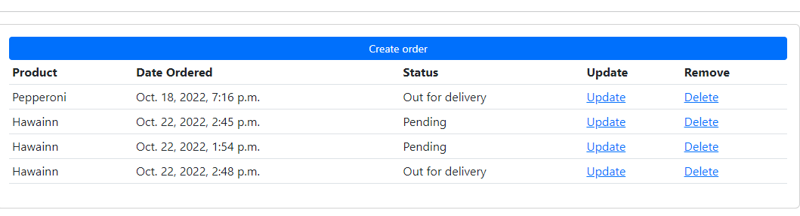
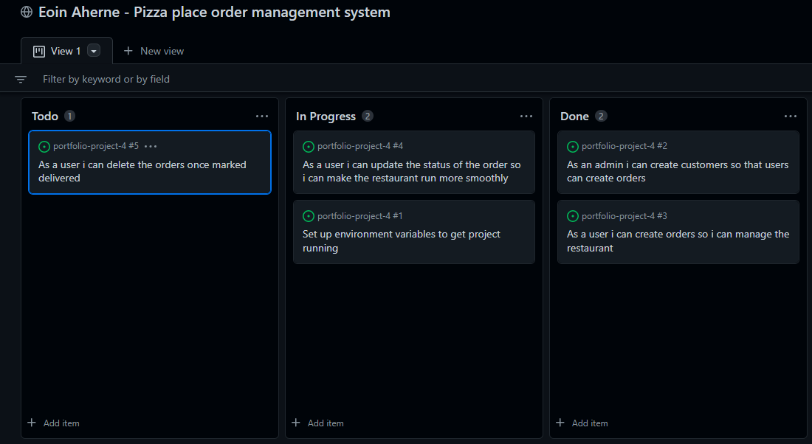
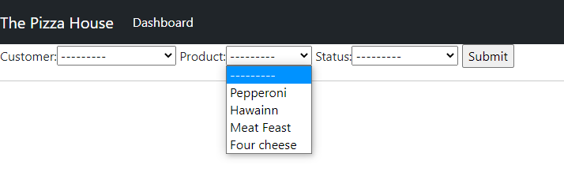
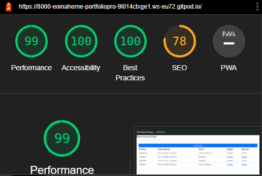

# About

Paradox22 is a pizza restaurant order management system app. Users on the front end can create, read, update and delete orders. While authenticated admistrative users on the back end have the ability to also create and delete customer profiles for the restaurant, as well as manage customer orders. 
Here you can find a link for the app deployed to [Heroku](https://paradox22.herokuapp.com/)

# User Stories

GitHub issues was used to create User Stories. These were catagorised in order of their priority

# Features

## Navbar

The navbar shown below was created with the help of Bootstrap technology. I gathered the components i needed and ammended them to suit the needs of the application. The navbar is also fully responsive. 

## Dashboard

The dashboard consists of a table that was created by harnassing the power of bootstrap once more. Choosing to make the table the width of the screen and fully responsive makes the application easy to understand when interacting with it. This is where the user has the ability to create, read, and update the order. The create order button will lead the user to a form page which will allow them to create the order. The ability to update and delete the order is activated by clearly labelled buttons of the same names

## Form

The form items are created by the admin on the back end. 
The user on the front end can select which items they want to populate the form once they select create order on the dashboard

# Testing

I have thoroughly examined this application for any errors that may arise when trying to use any of the functions. I have found that everything works as intended and the application can be utilised fully from front end and back end without issues. 

## Automated Testing

I ran the dev tools lighthouse testing and achieved a high scores for Performance, Accessibility and Best Practices 

## Validation

pep8 online was not working at the time of my project validation testing. I used the problem window in the console to validate any python errors i came across until they were all removed.  

## Technologies used

- HTML
- Bootstrap
- Python
- Django
- PostgreSQL
- Heroku
- Cloudinary

## Deployment

The application was deployed to Heroku as follows

- Step 1 - Install Django and supporting libraries 
- Step 2 - Create Heroku app on CLI 
- Step 3 - Add and attach the database
- Step 4 - Set environment variables in env.py
- Step 5 - Add secret key to config vars at Heroku.com
- Step 6 - Prepare Environment in setings.py file
- Step 7 - Make migrations
- Step 8 - Get static and media files stored on cloudinary *not used
- Step 9 - Create Procfile 
- Step 10 - Push Code 
- Step 11 - Deploy on main branch 

